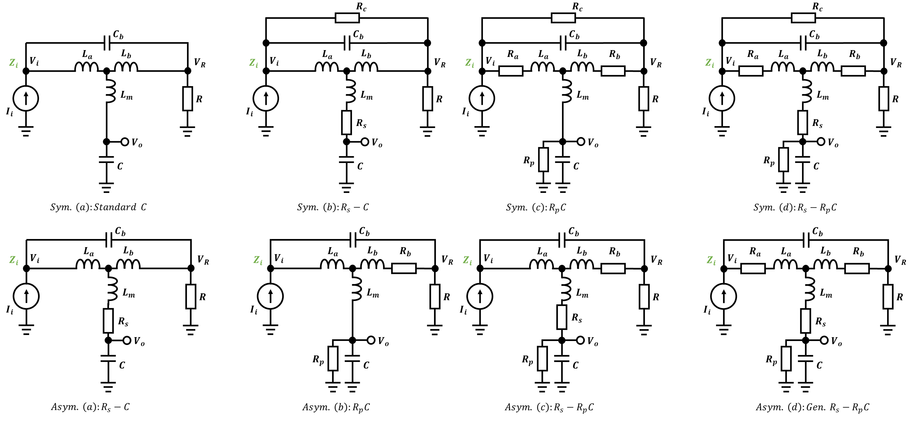

# T-CoilDesign
T-Coil Design using matlab

## 支持的T-Coil类型
### 对称(Symmetric) & 不对称(Asymmetric) T-Coil

## 计算公式
这里给出通用对称和非对称的matlab计算结果(若对Matlab符号计算感兴趣的同学可以下载$^{[1]}$)：

- 对称T-Coil
$$\begin{align}
L_a &= L_b = \frac{CR^2}{2} \notag{} \\ \
R_a &= R_b = \frac{R^2}{2R_p} \notag{} \\ \
R_c &= \frac{4R^2R_p}{R^2 + 4R_pR_s} \notag{} \\ \
T_1 &= \frac{R^2}{R_p^2} + 2\frac{R}{R_p} + 4\frac{R_s}{R_p} \notag{} \\ \
C_b &= \frac{C}{4}\frac{R_p^2}{R^2}[2\zeta^2(T_1 + 4) - 2\zeta\sqrt{(T_1 + 4 )[(T_1 + 4)\zeta^2 - T_1]} - T_1] \notag{} \\ \
L_m &=  R^2C_b-\frac{L_a}{2} \notag{} \\ \
w_n &= \frac{(T_1+4)\zeta + \sqrt{(T_1 + 4)[(T_1 + 4)\zeta^2  - T_1]}}{CR_pT_1} \notag{} \\ \
G_{vo} &=  \frac{4}{(\frac{R}{R_p}+1)^2+4\frac{R_s}{R_p}+3} \notag{} \\ \
\end{align}$$

- 非对称T-Coil
对于$R_p \neq \infty$:
$$\begin{align}
T_2 &= \frac{1}{R_a + R_p + R_s - R} \notag{} \\
T_3 &= T_2(R-R_a)+1 \notag{} \\
T_4 &= \frac{T_2R_p}{T_3^2} \notag{} \\
R_b &=  T_2(R-R_a)^2-R_a \notag{} \\
L_a &= R_pC(R-R_a)(\sqrt{R_pT_2}-1) \notag{} \\
L_b &= R_pC(R-R_a)[T_3-\sqrt{R_pT_2}] \notag{} \\
C_b &= C\frac{R_pT_3}{R(T_3-1)}\left[2\zeta^2  + \sqrt{T_4} - 1 - 2\zeta\sqrt{\zeta^2+\sqrt{T_4}-1}\right] \notag{} \\
L_m &=  R^2C_b-\frac{L_aL_b}{L_a+L_b} \notag{} \\
w_n &= \frac{\zeta+\sqrt{\zeta^2+\sqrt{T_4}-1}}{CR_p(1-\sqrt{T_4})} \notag{} \\
G_{vo} &=  \frac{1-\frac{R_a}{R}}{1+\frac{R_s}{R_p}} \notag{} \\
\end{align}$$

对于$R_p = \infty$，同之前BOB推导的公式。
上式中的$G_{vo}$表示从$V_o$输出的电压增益。

## 参考

[1]: [Guthub 源码], https://github.com/etools361/T-CoilDesign \
[2]: [T-Coil设计，电路设计小工具],  \
[3] :[Wang_Algebra_From_Theory_to_Practice, BOB ROSS], https://arxiv.org/abs/2208.09649,https://spiral.imperial.ac.uk/bitstream/10044/1/101108/10/Wang_Algebra_From_Theory_to_Practice.pdf \
[3b] :[王氏代数：从理论到实践, BOB ROSS], https://mp.weixin.qq.com/s/S_89anAlWo924alZcdJAPw \

